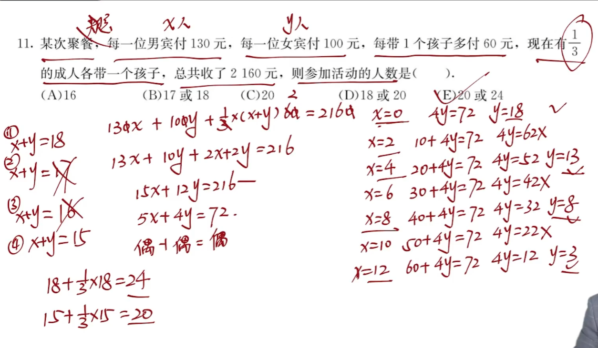

# 第一讲

##  短除法求最小公倍数、最大公因数

## 母题模型1：带余除法问题

### 余同加余

一个数除4，5，6都余1，求这个数的最小可能值

$x-1 = (4,5,6)k$
$$

$$
$x= (4,5,6)k +1$

### 差同减差

一个数除4，5，6分别余3，4，5（差1个整除），求这个数的最小可能值

$x+1 =(4,5,6)k$

$x = (4,5,6)k-1$

### 和同加和

一个数除4余3，除5余2，除6余1（和相同），求这个数的最小可能值

$\begin{cases}x-3 = 4k_1 \\x-2 = 5k_2 \\ x-1 = 6k_3 \end{cases}$

$\begin{cases}x-7 = 4k_1-4 \\x-7 = 5k_2-5 \\ x-7 = 6k_3-6 \end{cases},说明(x-7)可以被4，5，6整除$

$x-7 = (4,5,6)k$

$x = (4,5,6)k+7$

### 注意

题目中有可能不会直观的体现和同、余同、差同，例如除2余1等价于除2差1等价于除2多1，要会转化

### 无规律

1.列等式

2.拆大系数项

3.讨论倍数

e.g.除5余3，除8余4

$5k_1+3 = 8k_2+4$

$5(k_1-k_2)=3k_2+1,令k_2取值满足整数要求，这里取k_2=3$

代入求得即可

## 母题模型2：质数合数问题

### 质数的倒数和问题

x,y,z为质数，倒数和为$\frac{1661}{1986}$,求xyz的和

$通分发现分母即为xyz，于是将1986用短除法得到3个质因数，即为xyz$

### 多项式质数问题

x∈Z，$x^2+8x-20$为质数，求这个质数。

$x^2+8x-20\rightarrow （x-2）(x+10)为质数 \rightarrow 其中一个为1，另一个即为质数本身。讨论$

## 母题模型3：约数倍数问题

### 公式一则

$$
x*y = (x,y)*[x,y]
$$

### 公式解题

$$
\begin{cases} x = ak\\y = bk\\(x,y) = k\\ [x,y]=abk\\(a,b)=1\end{cases}
$$

e.g.最大公因数是6，最小公倍数是72，解xy

k=6,abk = 72,ab =12,由于ab互质

讨论ab的多种组合 1x12？3x4？2x6？（排除）

将ak，bk分别带入看哪个满足题设

## 母题模型4：整数不定方程问题

### 加法模型

#### 识别

1.正整数

2.不定方程（方程个数不足以求解未知数）

3.加法运算

#### 方法

1.列出方程

2.奇偶分析

3.尾数分析

4.倍数分析

### 乘法模型

#### 公式

$a^2-b^2 = (a+b)(a-b)$

$abab公式：ab-ma-nb +mn=(a-n)(b-m)$

## 母题模型5：实数的运算

### 裂项公式

$(1).\frac{1}{n(n+k)}=\frac{1}{k}*(\frac{1}{n}-\frac{1}{n+k})$

$(2).\frac{n-1}{n!}=\frac{1}{(n-1)!}-\frac{1}{n!}$

$(3).\frac{1}{\sqrt{n+k}+\sqrt{n}}=\frac{1}{k}(\sqrt{n+k}-\sqrt{n})$

$(4).(a+b)(a^2+b^2)(a^4+b^4)+...(a^{2^n}+b^{2^n})=\frac{(a-b)(a+b)(a^2+b^2)(a^4+b^4)+...(a^{2^n}+b^{2^n})}{a-b}$

### 多括号相乘

$1-\frac{1}{n}型$：

$(1-\frac{1}{2})*(1-\frac{1}{3})*(1-\frac{1}{4})...=\frac{1}{2}*\frac{2}{3}*\frac{3}{4}...$

$1-\frac{1}{n^2}型$：

利用平方差公式，减和减放一起，加和加放一起变成$1-\frac{1}{n}$型

## 母题模型6：比例运算

### 比例的性质

$等比公式:\frac{a}{b}=\frac{c}{d}=\frac{e}{f}=\frac{a+b+c}{d+e+f}$

### 比例统一问题

1.统一公共项

$甲：乙=7：5，乙：丙=3：4，则甲：乙：丙？→21：15：20$

2.统一不变项

$甲：乙=7：5，甲-10后，甲：乙变成了4：3，问人数？→21：15→20：15，一份10人。$

3.统一总量

$甲：乙=7：5，甲中10人去了乙，变成了1：1，问人数？→7：5→6：6，一份10人。$

## 母题模型7：绝对值的三角不等式

$||a|-|b|| \le |a+b| \le|a|+|b|$

$||a|-|b||\le|a-b|\le|a|+|b|$

注：关于这个绝对值的三角不等式，我总结为：同号不变，异号变号。指的是中间的量与两边比，若是不变号满足，则为同号，否则反之。举例$||a|-|b||\le|a-b|$，减号不变，ab同号。

# 第二讲

## 母题模型8：整式运算

### 常用公式

$(a+b+c)^2=(a^2+b^2+c^2+2ab+2ac+2bc)$

$a^2+b^2+c^2+ab+bc+ac=\frac{1}{2}[(a+b)^2+(a+c)^2+(b+c)^2]$

$(a\pm b)^3=(a\pm b)(a^2\mp ab+b^2),完全立方公式为1331$

## 母题模型9：因式定理＆余式定理

### 因式

F(x)=f(x)g(x),F(x)被f(x)整除。$若存在a使得f(a)=0←→则x-a是F(x)的一个因式$

### 余式

F(x)=f(x)g(x)+r(x),同上a，则F(a)=r(x)

## 母题模型10：形如$x+\frac{1}{x}=a$的求值

### $x+\frac{1}{x}$的递推

已知$x+\frac{1}{x}$：

$x^2+\frac{1}{x^2}=(x+\frac{1}{x})^2-2$

$x^3+\frac{1}{x^3}=(x+\frac{1}{x})^3-3(x+\frac{1}{x})$

$x-\frac{1}{x}=\pm\sqrt{x^2+\frac{1}{x^2}-2}$

### $x^2+ax+1=0$的降幂

$\begin{cases}x^2=-ax-1\\x^2+ax=-1\\x^2+1=-ax\\x+\frac{1}{x}=-a  \end{cases}$

!

# 第三讲

##  母题模型11：均值不等式

### 母题识别

已知几个字母的和或积的值，求另一个多项式的最值；类似对勾函数的问题

### 最基础：一正二定三相等

$ax+\frac{b}{x}\ge 2\sqrt{ab},>0;全项相等时取等$

### 变式：不止两项或不止二次的均值不等式

$\frac{a}{n}x+\frac{a}{n}x+..._{n项}+\frac{b}{x^n} \ge n\sqrt[n]{\frac{a^nb}{n^n}}$

### 方法

求和的最小值：均等拆分低次项

求积的最大值：均等拆分高次项

### 1的代换

$a+2b=1$,求$\frac{1}{a}+\frac{2}{b}$的最值

$(a+2b)*(\frac{1}{a}+\frac{2}{b})=5+\frac{2b}{a}+\frac{2a}{b}\ge5+2\sqrt{4}=9$

### 证明不等式

两个例题

## 母题模型12：柯西不等式

$(a^2+b^2)(c^2+d^2)\ge (ac+bd)^2,ad=bc时取等$

$原理：a^2c^2+\underline{b^2c^2+a^2d^2}+b^2d^2\ge a^2c^2+2bcad+b^2d^2=(ac+bd)^2$

$2(x^2+y^2)\ge(x+y)^2 \ge4xy,x=y时取等$

$原理：x^2+y^2+\underline{x^2+y^2}\ge x^2+y^2+2xy=(x+y)^2$

## 母题模型13：二次函数的基本问题

### 区间根

基本的思想就是两个根对应图像的两个零点：

两根在不同区间时,例如

$x_1 < 1< x_2 \rightarrow af(1)<0$

$x_1∈(1,2),x_2∈(2,3) \rightarrow \begin{cases} af(1)>0\\af(2)<0\\af(3)>0\end{cases}$

两根在同区间时，还需考虑Δ和对称轴的关系

$x_1,x_2∈(1,2)\rightarrow \begin{cases} Δ \ge 0 \\ -\frac{b}{2a}∈(1,2)\\af(1),af(2)>0\end{cases}$

$1<x_1<x_2 \rightarrow \begin{cases} Δ>0\\ -\frac{b}{2a}>1\\af(1)>0\end{cases}$

# 第四讲

## 母题模型14：数列连续等长片段和

在等差或等比数列中，形似$S_m,S_{2m}-S_m,S_{3m}-S_{2m}$的被称为数列连续等长片段和

### 等差数列

对于等差数列：

$S_m=a_1+a_2+...+a_m$

$S_{2m}-S_m=a_{m+1}+a_{m+2}+...+a_{2m}$

下减上，得：

$(S_{2m}-S_m) -S_m=md+md+...+md=m^2d,为定值$

同理可推广，故等差数列的连续等长片段和为等差数列，公差为$m^2d$.

### 等比数列

对于等差数列：

$S_m=a_1+a_2+...+a_m$

$S_{2m}-S_m=a_{m+1}+a_{m+2}+...+a_{2m}$

下除上，得：

$(S_{2m}-S_m) \div S_m=\frac{a_{m+1}+a_{m+2}+..+a_{2m}}{a_1+a_2+..+a_m}=\frac{q^m(a_1+a_2+..+a_m)}{a_1+a_2+..+a_m}=q^m,为定值$

同理可推广，故等比数列的连续等长片段和为等比数列，公比为$q^m$.

## 母题模型15：递推数列问题

构造特殊数列，例如差后等差数列等。例题：

### 类等差数列

识别：

$a_{n+1}-a_n = f(n)，特点是a_{n+1}与a_n系数相同$

方法：

先写几项观察规律（如上例题，即找出$f(n)$），后用累加法求解。如果是单选题，先代特殊值

### 类等比数列

识别：

$\frac{a_{n+1}}{a_n} = f(n)，特点是a_{n+1}与a_n系数不同，递推式无常数项$

方法：

先写几项观察规律（如上例题，即找出$f(n)$），后用累乘法求解。如果是单选题，先代特殊值

### 类一次函数数列

识别：

$a_{n+1}=A*a_n+B,特点是系数不同有常数项$

方法：

构造等比数列法：左右加t，令$a_{n+1}+t=A*a_n+B+t=A(a_n+t)$，写$a_n+t$的通项公式

### $S_n$与$a_n$的关系型

原理：

$$
\begin{cases}S_n-S_{n-1}=a_n\\S_1=a_1 \end{cases}
$$

# 第五讲

## 母题模型16：平面几何的基本问题

### 中线、角平分线定理

#### 中线

在ΔABC中，AD是BC上的中线，则有:$AB^2+AC^2=2AD^2+2BD^2=2AD^2+2CD^2$

#### 角平分线

在ΔABC中，AD是BC上的角平分线，则有：$\frac{BD}{DC}=\frac{AB}{AC}$

### 圆有关的定理

#### 垂径定理

#### 切割线定理

$CD^2=AD*BD(用相似三角形证明)$

### 三角形有关定理

#### 内心

内心即为三角形内切圆的圆心，是三条**角平分线的交点**。记忆：角平分线到角两边距离相等，内切圆圆心到边的距离相等

$$
\begin{cases}S_Δ=\frac{1}{2}(AC+AB+BC)r\\AE=AF,CE=CD,BD=BF\\if \ RtΔ：r=\frac{a+b-c}{2}\end{cases}
$$

#### 外心

外心即为三角形外接圆的圆心，是**垂直平分线的交点**。记忆：垂直平分线上的点到两端点的距离相等，三角形的端点在外接圆上。

$S_Δ=\frac{abc}{4R}$​

由正弦定理证明：

​	$\frac{a}{SinA}=\frac{b}{SinB}=\frac{c}{SinC}=2R$

​	$S=\frac{1}{2}abSinc$

**特别的，对于直角三角形，外接圆的圆心是斜边上的中点。**

#### 重心

重心即为三角形三条**中线的交点**。记忆：由于重心的物理意义要求平均。

**中线2：1，面积1：1定理**

重心把每一条中线都分成2：1的两部分，把整个三角形的面积平均分给六个小三角形；在平面直角坐标系中，重心的坐标也是三个端点的平均。

## 母题模型17：平面几何五大模型

### 等面积模型

### 共角模型

### 相似模型

### 燕尾模型

### 风筝/蝴蝶模型

