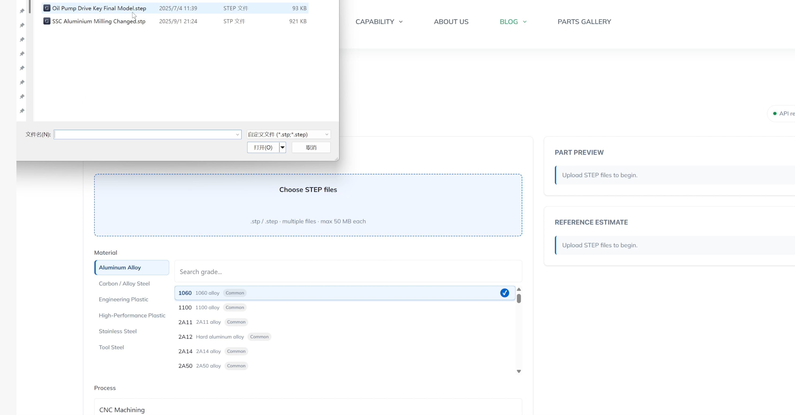
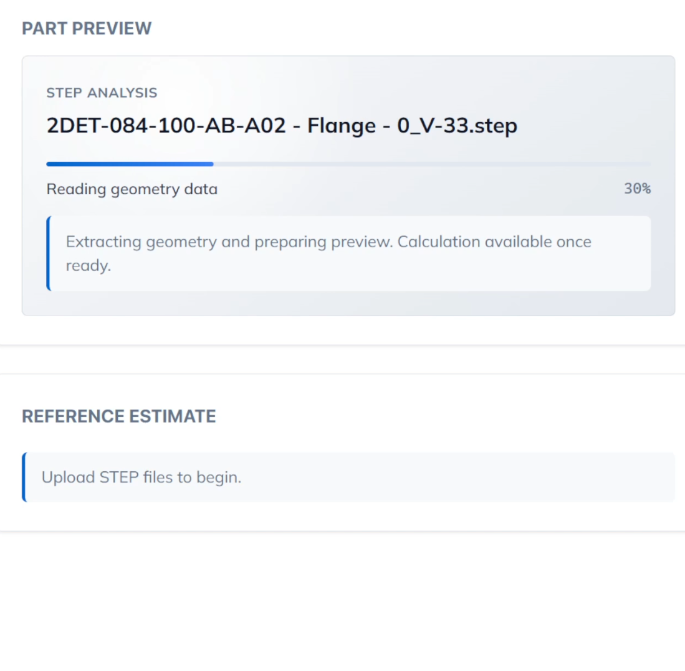
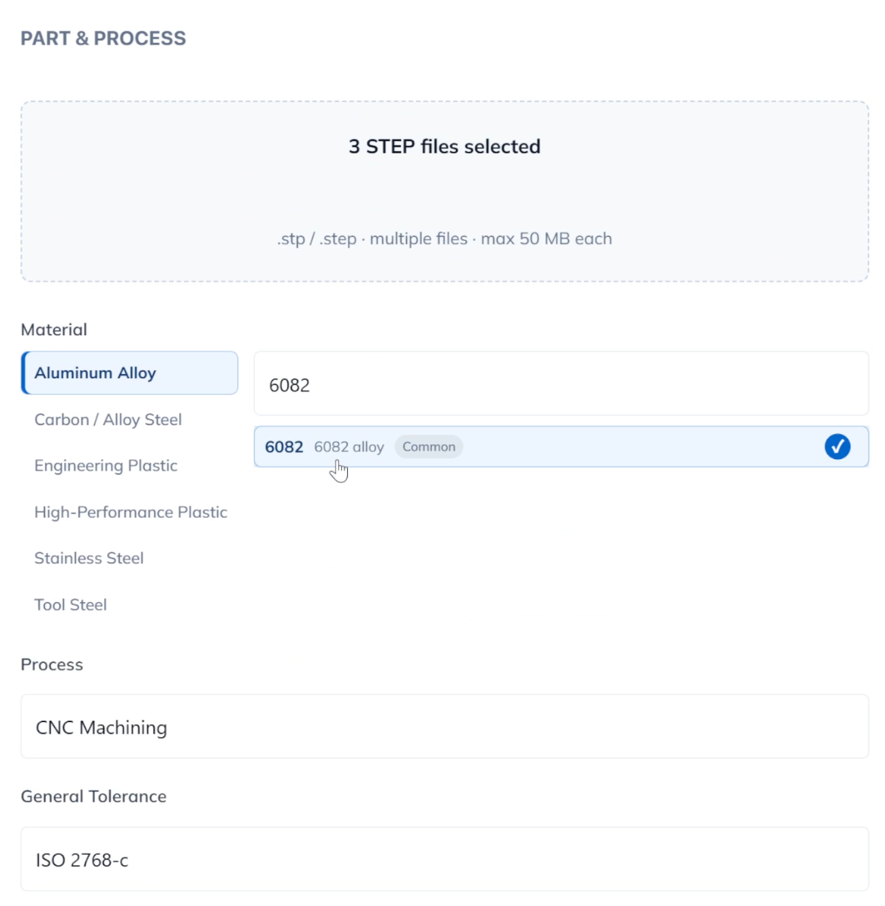
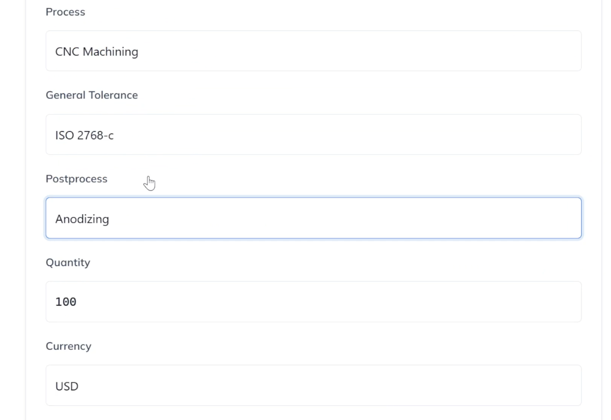
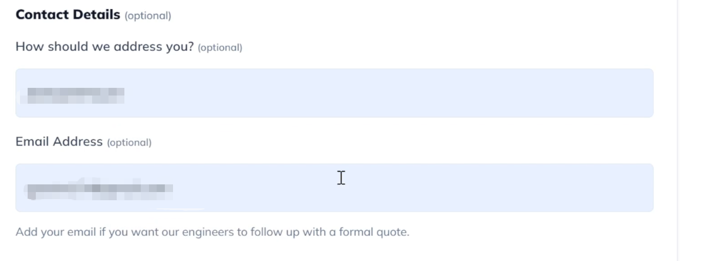
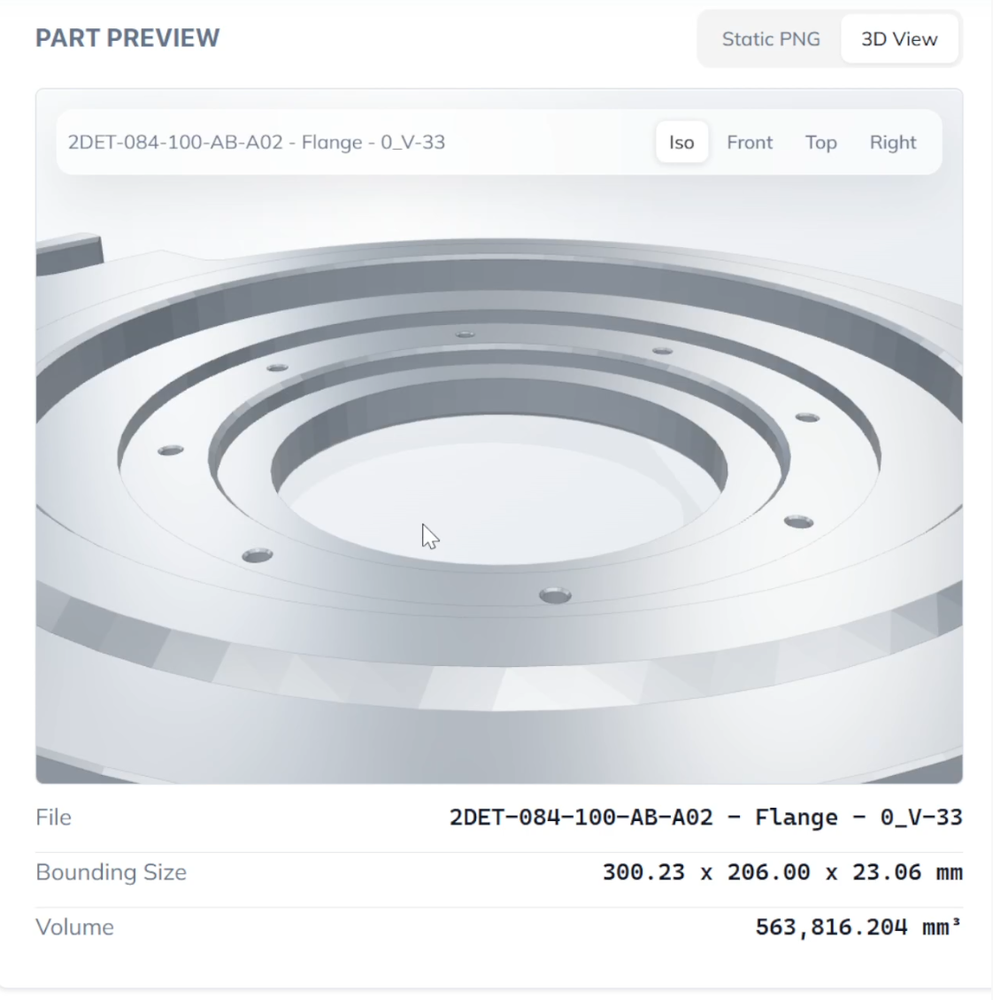
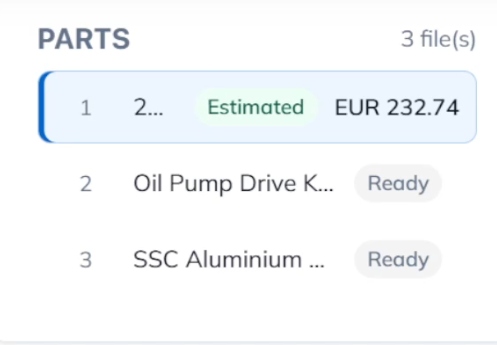
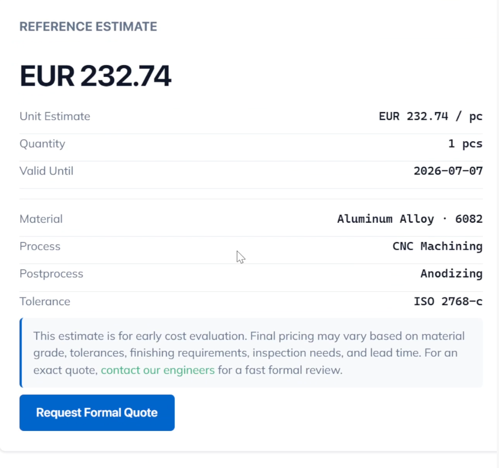

# MFG Solution Online Quote 使用说明

在线报价入口：[https://mfg-solution.com/online-quote/](https://mfg-solution.com/online-quote/)

MFG Solution Online Quote 用于在早期方案阶段快速评估 CNC 零件的参考成本。用户上传 `.stp` 或 `.step` 格式的 3D 文件后，系统会自动解析几何数据，生成零件预览，并结合材料、加工方式、公差、后处理、数量和币种给出在线估价。

> 在线估价适合用于早期成本判断。正式报价仍会结合具体材料牌号、图纸要求、公差、表面处理、检验要求、交期和可制造性进行工程审核。

## 1. 选择并上传 STEP 文件

点击页面中的 **Choose STEP files**，选择一个或多个 `.stp` / `.step` 文件。系统支持多文件上传，适合一次性评估多个零件。

建议上传最终版本或接近最终版本的 STEP 文件。文件越接近真实生产模型，系统解析出的体积、包围尺寸和预估结果越有参考意义。

## 2. 等待系统解析零件

上传后，系统会进入 **STEP Analysis** 阶段，自动读取几何数据并准备预览图。解析过程中会显示当前文件名、进度和状态提示。

当解析完成后，零件会进入 Ready 状态，此时可以继续设置材料、加工方式和其他报价参数。

## 3. 选择材料大类与具体牌号

在 **Material** 区域，先选择材料大类，例如 **Aluminum Alloy**、**Stainless Steel**、**Engineering Plastic** 等，再在右侧搜索或选择具体材料牌号。

如果列表中没有所需材料，或项目需要指定特殊牌号、进口材料、认证材料、替代材料建议，可以通过 [Request Formal Quote](https://mfg-solution.com/request-quote/) 联系工程师进行专业分析。

## 4. 设置加工、公差、后处理、数量和币种

依次确认以下参数：

- **Process**：加工方式，例如 CNC Machining。
- **General Tolerance**：通用公差等级，例如 ISO 2768-c。
- **Postprocess**：后处理方式，例如 Anodizing。
- **Quantity**：数量批次。
- **Currency**：报价币种，可选USD、EUR。

这些参数会直接影响估价结果。若零件存在更复杂的要求，例如局部高精度、特殊检测、热处理、装配配合、外观件要求或指定交期，建议提交正式询盘，让工程师进行完整评估。

## 5. 可选填写联系人信息

在 **Contact Details** 中，可以填写称呼和邮箱地址。该部分为选填。

如果希望后续收到报价结果、工程反馈或正式报价跟进，建议留下邮箱。工程师可根据上传文件和填写参数进一步确认材料、工艺、交期与报价细节。

## 6. 查看零件预览

右侧 **Part Preview** 区域支持两种预览方式：

- **Static PNG**：静态零件预览图，便于快速确认模型外观。
- **3D View**：交互式 3D 展示，可切换视角并查看零件几何信息。

预览区域还会显示文件名、包围尺寸和体积信息，用于辅助确认上传模型是否正确。若发现模型版本不对、方向异常或尺寸明显不符合预期，应重新上传正确文件后再计算。

## 7. 多零件上传时逐个确认

如果一次上传多个零件，左侧会出现 **Parts** 列表。用户可以逐个选择零件，查看对应预览，并为不同零件设置独立的材料、加工方式、公差、后处理和数量。

已完成估价的零件会显示 Estimated，已解析但未计算的零件会显示 Ready。这样可以在一个页面中完成多个零件的快速评估，适合小批量项目、装配件项目或多版本方案对比。

## 8. 获取在线参考估价

参数确认后，点击计算按钮，系统会生成 **Reference Estimate**。结果中会显示单件估价、数量、有效期、材料、加工方式、后处理和公差信息。

在线结果可作为早期成本评估和方案筛选依据。若需要用于采购、项目立项、客户报价或生产排期，请点击 **Request Formal Quote**，或通过 [contact our engineers](https://mfg-solution.com/request-quote/) 提交正式评审。工程师会结合图纸、材料、表面处理、检验标准、交期和实际制造风险给出更准确的正式报价。

## 使用建议

- 上传 STEP 文件前，确认模型单位、尺寸和版本正确。
- 对材料、后处理、公差没有明确要求时，可先选择常用选项获得初步参考。
- 有特殊材料、复杂曲面、薄壁结构、紧配合、公差链、外观面或指定交期时，建议直接提交正式询盘。
- 多零件项目可以一次上传并逐个设置参数，减少重复操作。
- 在线估价不替代正式商业报价，最终价格以工程审核后的正式报价为准。

